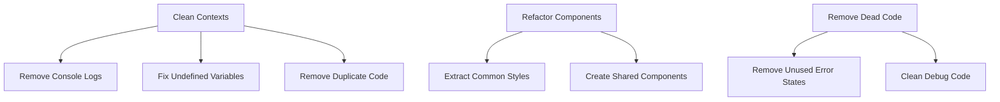

# Code Cleanup Plan

## 1. Identified Areas for Cleanup

### Context Files
- **LoanContext.js**
  - Remove unnecessary console.log statements
  - Fix undefined `updates` variable in updateLoanAmount
  - Remove unused error state handling
  - Streamline notification handling

- **AuthContext.js**
  - Consolidate resetPassword implementation
  - Remove duplicate code between App.js and AuthContext.js
  - Clean up unused parameters

### Dashboard Components
- Extract common styles and components
- Create shared components for:
  - Dashboard cards
  - Top navigation bar
  - Common layout elements

## 2. Implementation Steps

## 3. Detailed Changes

### Phase 1: Context Cleanup
1. Remove console.log statements from LoanContext
2. Fix undefined updates variable in updateLoanAmount
3. Consolidate resetPassword implementation
4. Remove unused error state
5. Optimize notification handling

### Phase 2: Component Refactoring
1. Create shared styles file for dashboard components
2. Extract common components:
   - DashboardCard
   - TopBar
   - NavigationHeader
3. Implement shared layout components

### Phase 3: Code Organization
1. Move all AuthContext logic to AuthContext.js
2. Implement proper error handling
3. Remove redundant code
4. Clean up unused imports

## 4. Safety Measures
- Each change will be tested individually
- Changes will be made incrementally
- Existing functionality will be preserved
- All routes and navigation will remain unchanged